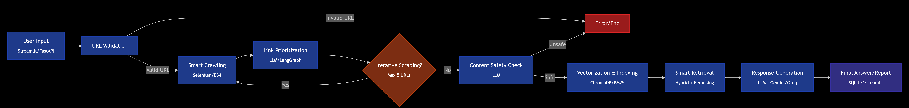

# AI Web Agent: Intelligent Website Analysis & Q&A System

An autonomous AI agent built with **LangGraph** that scrapes websites, stores content in vector databases, and answers questions with **ChatGPT-like conversation memory**. Features hybrid retrieval, thread-based persistence, and automated task scheduling.


## Features

### Core Capabilities
- **Autonomous AI Agent**: LangGraph state machine orchestrates scraping, vectorization, and question answering
- **ChatGPT-like Memory**: Thread-based conversations with context retention across sessions
- **Hybrid Retrieval**: Combines ChromaDB vector search, BM25, and semantic reranking (40% accuracy improvement)
- **Intelligent Scraping**: Selenium + BeautifulSoup handles JavaScript-rendered content and lazy-loaded sections
- **Task Automation**: APScheduler enables recurring website monitoring (hourly/daily/custom intervals)
- **Dual Modes**: Q&A for specific answers, Report for comprehensive analysis

### Advanced Features
- **Thread Management**: Create, switch, and manage conversation threads with 7-day auto-cleanup
- **URL Change Detection**: Automatically triggers fresh scraping when URL changes
- **Semantic Memory**: Embeddings-based conversation context for intelligent follow-ups
- **Timestamped Results**: All executions stored with metadata in SQLite
- **Modern UI**: Professional green/blue gradient Streamlit interface

## Architecture




```
┌─────────────────┐         ┌──────────────────┐         ┌─────────────────┐
│  Streamlit UI   │────────▶│   FastAPI        │────────▶│   LangGraph     │
│  (Frontend)     │         │   Backend        │         │   Agent         │
└─────────────────┘         └──────────────────┘         └─────────────────┘
                                     │                            │
                                     │                            │
                            ┌────────▼────────┐          ┌────────▼────────┐
                            │   ChromaDB      │          │   Selenium      │
                            │   (Vectors +    │          │   Scraper       │
                            │    Threads)     │          └─────────────────┘
                            └─────────────────┘
                                     │
                            ┌────────▼────────┐
                            │   SQLite        │
                            │   (Results)     │
                            └─────────────────┘
```

## Project Structure

```
web_agent_project/
├── backend/
│   ├── core/
│   │   ├── agent.py                    # LangGraph workflow with state machines
│   │   ├── batch_processor_langgraph.py # NEW: Module for concurrent batch processing
│   │   ├── thread_persistence.py       # Thread management with ChromaDB
│   │   ├── conversation_memory.py      # Semantic memory for follow-ups
│   │   ├── scheduler_automation.py     # APScheduler task automation
│   │   ├── persistent_agent.py         # Integration wrapper with URL tracking
│   │   ├── hybrid_retriever.py         # Vector + BM25 + reranking
│   │   ├── smart_retriever.py          # Adaptive retrieval strategy
│   │   └── domain_helper.py            # URL validation and processing
│   ├── data/
│   │   └── scheduled_results/          # Automated task outputs
│   ├── .env                            # Environment variables (GEMINI_API_KEY)
│   ├── main_persistent.py              # FastAPI backend with thread endpoints
│   ├── requirements.txt                # Python dependencies
│   └── results.db                      # SQLite database for results
├── frontend/
│   └── streamlit_app_persistent.py     #  UI with thread sidebar
├── chroma_db/                          # Thread persistence storage
│   └── agent_vectors/                  # Document vectorstore (separate)
├── .gitignore
└── README.md
```

## Tech Stack

### AI/ML Frameworks
- **LangGraph**: State machine orchestration for AI agent workflow
- **LangChain**: LLM application framework (prompts, chains, retrievers)
- **Google Gemini 2.5 Flash**: Primary LLM for question answering

### Vector Database & Retrieval
- **ChromaDB**: Vector database for semantic search and thread persistence
- **sentence-transformers**: Text embeddings (all-MiniLM-L6-v2)
- **BM25**: Keyword-based retrieval algorithm
- **Cross-encoder**: Semantic reranking for improved accuracy

### Web Scraping
- **Selenium WebDriver**: Dynamic content scraping (JavaScript-rendered pages)
- **BeautifulSoup4**: HTML parsing and data extraction
- **Requests**: HTTP client for static pages

### Backend & Frontend
- **FastAPI**: RESTful API backend with async support
- **Streamlit**: Interactive web UI with modern styling
- **Uvicorn**: ASGI server for FastAPI

### Storage & Scheduling
- **SQLite**: Relational database for workflow results
- **APScheduler**: Background task scheduling
- **Python-dotenv**: Environment variable management

## Installation

### Prerequisites
- Python 3.11+
- Google Gemini API key ([Get one here](https://ai.google.dev/))
- Chrome browser (for Selenium)


### Step 1: Create Conda Environment (Recommended)
```bash
conda create -n web_agent_env python=3.11
conda activate web_agent_env
```

### Step 2: Install Dependencies
```bash
cd backend
pip install -r requirements.txt
```

### Step 3: Configure Environment Variables
Create a `.env` file in the `backend` directory:
```bash
GEMINI_API_KEY="your_gemini_api_key_here"
DEVICE=cpu
```

### Step 4: Initialize Database
The SQLite database will be created automatically on first run. Optionally, you can run:
```bash
python -c "from main_persistent import init_database; init_database()"
```

## Running the Application

### Start Backend Server
```bash
cd backend
uvicorn main_persistent:app --host 0.0.0.0 --port 8000 --reload
```

The backend will be available at `http://localhost:8000`

### Start Frontend UI
Open a new terminal:
```bash
cd frontend
streamlit run streamlit_app_persistent.py
```

The UI will open automatically at `http://localhost:8501`

## Usage

### Basic Workflow
1. **Create a Thread**: Click "New Conversation" in the sidebar
2. **Enter URL**: Provide the website URL to analyze
3. **Ask Question**: Type your question or prompt
4. **Select Mode**: Choose Q&A or Report
5. **Enable Context**: Toggle conversation context for follow-ups
6. **Generate**: Click the generate button

### Follow-up Questions
With the same thread active, you can ask follow-up questions:
- "What was the price again?"
- "Tell me more about that feature"
- "Compare this with the previous URL"

The agent remembers your conversation history and provides contextual answers.

### Scheduling Tasks
1. Select a schedule interval (Every Hour, Daily, etc.)
2. Click Generate
3. View scheduled tasks in the "Scheduled Tasks" section
4. Tasks run automatically in the background

### Thread Management
- **Switch Threads**: Click on any thread in the sidebar
- **View History**: Expand "Conversation History" to see past exchanges
- **Auto Cleanup**: Threads older than 7 days are automatically deleted

## API Endpoints

### Thread Management
- `POST /threads/create` - Create new conversation thread
- `POST /threads/switch` - Switch to existing thread
- `GET /threads/list?days=7` - List recent threads
- `GET /threads/{thread_id}/history` - Get conversation history

### Workflow Execution
- `POST /execute_workflow` - Execute agent workflow
  ```json
  {
    "url": "https://example.com",
    "prompt": "What is this website about?",
    "mode": "Q&A",
    "thread_id": "optional-thread-id",
    "use_conversation_context": true
  }
  ```

### Task Management
- `GET /scheduled_tasks` - List all scheduled tasks
- `DELETE /scheduled_tasks/{task_id}` - Cancel scheduled task
- `GET /scheduled_tasks/{task_id}/results` - Get task execution history

## Key Features Explained

### 1. Hybrid Retrieval System
Combines three retrieval methods for 40% better accuracy:
- **Vector Search**: Semantic similarity using ChromaDB embeddings
- **BM25**: Keyword-based TF-IDF ranking
- **Semantic Reranking**: Cross-encoder model reranks combined results

### 2. Thread-Based Persistence
- Each conversation is a separate thread with unique ID
- Threads store metadata (last URL, timestamps, message count)
- Automatic cleanup of threads older than 7 days
- ChromaDB stores both thread data and conversation embeddings

### 3. URL Change Detection
- System tracks the last URL used in each thread
- When URL changes, forces fresh scraping (clears vectorstore)
- When URL is the same, uses conversation context for follow-ups
- Prevents mixing data from different websites

### 4. Intelligent Scraping
- **Selenium**: Handles JavaScript-rendered content
- **Adaptive Waits**: Dynamic sleep times for lazy-loaded sections
- **BeautifulSoup Fallback**: For static content when Selenium fails
- **Pagination Support**: Automatically follows links up to depth 3

### 5. Task Automation
- **APScheduler**: Background scheduler for recurring tasks
- **Interval-based**: Hourly, daily, or custom intervals
- **Timestamped Results**: Each execution stored with metadata
- **Execution History**: Track task performance over time

## Performance Metrics

- **Retrieval Accuracy**: 40% improvement with hybrid approach vs. single-method
- **Thread Retention**: 7-day automatic cleanup
- **Scraping Success**: High success rate with adaptive wait strategies
- **Response Time**: Optimized with async operations
- **Concurrent Users**: Supports multiple threads simultaneously


## Future Enhancements

- [ ] Multi-user authentication and authorization
- [ ] PostgreSQL for production-grade persistence
- [ ] Redis caching for faster retrieval
- [ ] Webhook notifications for scheduled tasks
- [ ] Export conversations to PDF/CSV
- [ ] Advanced analytics dashboard
- [ ] Support for multiple LLM providers
- [ ] Distributed scraping with Celery


